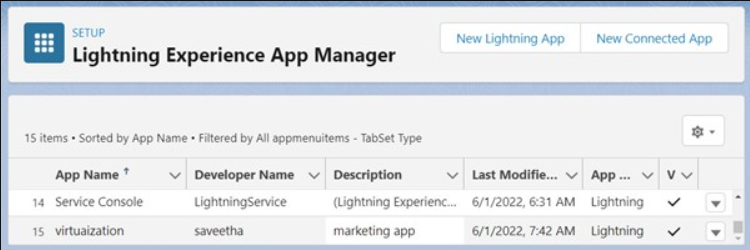

# Ex-05-Creating-a-Warehouse-Application-in-SalesForce.com

## AIM:
To create a warehouse application in salesforce.com

## Procedure

### Types of Applications in SFDC

In Salesforce.com, we have two types of Applications they are
1.	Classic Apps and
2.	Lightning Apps.

In Salesforce we can create, manage and customise both applications according to user requirement.

## PROCEDURE

### Step 1: Log into your developer

### Step 2: Click the Setup Link (upper-right corner).

### Step 3: In the Left Navigation, Platform tools, then click App Manager

### Step 4: Click New Lightning App

### Step 5: 
After Next, define the fields for the custom app.
•	App Label: Search Service.
•	App Name: Search Service.
•	Description: Search Service is one app where we manage all the business data and catalogues.

### Step 6: Choose the Image Source for the Custom App Logo.

Note: Before inserting an image for the logo you need to use the following procedure to add an image to the image gallery.
 
### Step 7: Select Console Option

### Step 8: Select a utility item

### Step 9: Select any of the user profiles. Then Click Save &Finish

 
### Step 10: A new app will be created and displayed

## RESULT:

Thus, creating a Warehouse Application in SalesForce.com is successfully created.
